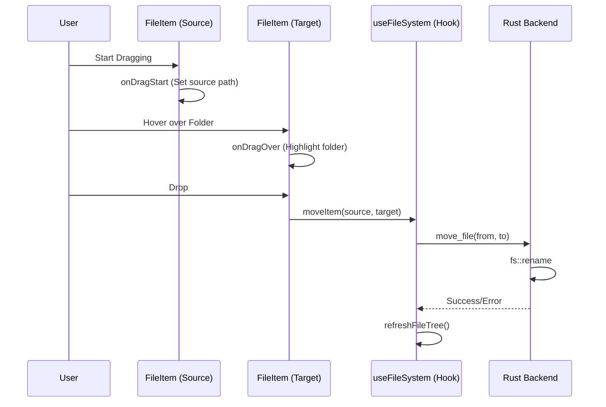

# Drag and Drop System Technical Overview

This document outlines the implementation of the Drag and Drop (D&D) functionality in VoiDesk, allowing for file movement within the file tree.

## Architecture Overview

The D&D system is built on standard Web Drag and Drop APIs, coordinated through high-level React components and a Rust-based backend for physical file operations.

### Flow Diagram



## Frontend Implementation

### 1. Drag Source (`FileItem.tsx`)
Individual items are marked as `draggable`. When a drag begins, we store the absolute path in the `dataTransfer` object using the `text/plain` MIME type for maximum compatibility.

```tsx
const handleDragStart = (e: React.DragEvent) => {
    e.dataTransfer.setData("text/plain", node.path);
    e.dataTransfer.effectAllowed = "move";
};
```

### 2. Drop Target (`FileItem.tsx`)
Only directories (`isDir: true`) are configured to receive drops. We use a local state `isDragOver` to handle visual highlights.

```tsx
const handleDrop = async (e: React.DragEvent) => {
    if (node.isDir) {
        e.preventDefault();
        const sourcePath = e.dataTransfer.getData("text/plain");
        if (sourcePath && sourcePath !== node.path) {
            const fileName = sourcePath.split(/[/\\]/).pop();
            const separator = node.path.includes('\\') ? '\\' : '/';
            const targetPath = `${node.path}${separator}${fileName}`;
            await moveItem(sourcePath, targetPath);
        }
    }
};
```

### 3. File System Hook (`useFileSystem.ts`)
The `moveItem` function wraps the Tauri command and triggers a state refresh.

```typescript
const moveItem = async (from: string, to: string) => {
    try {
        await invoke("move_file", { from, to });
        await refreshFileTree(rootPath);
        return true;
    } catch (err) {
        console.error("Move error:", err);
        return false;
    }
};
```

## Backend Implementation

### `move_file` Command (`file_commands.rs`)
The backend uses a standard `fs::rename` operation. This is efficient as it atomic-moves files on the same disk partition.

```rust
#[tauri::command]
pub async fn move_file(from: String, to: String) -> Result<(), String> {
    fs::rename(from, to).map_err(|e| e.to_string())
}
```

## Key Considerations
- **Propagation**: `e.stopPropagation()` is critical to prevent a drop on a child folder from triggering the parents' drop handlers.
- **Cross-Platform Paths**: The system dynamically detects whether to use `\` or `/` based on the target path's structure to ensure Windows and Unix compatibility.
- **Auto-Refresh**: After a successful move, `refreshFileTree` is called to immediately update the UI state.
