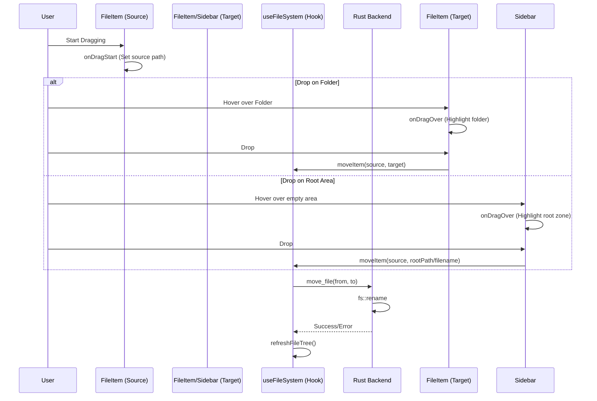

# Drag and Drop System Technical Overview

This document outlines the implementation of the Drag and Drop (D&D) functionality in VoiDesk, allowing for file movement within the file tree.

## Architecture Overview

The D&D system is built on standard Web Drag and Drop APIs, coordinated through high-level React components and a Rust-based backend for physical file operations.

### Supported Operations

- **Move files/folders into any folder**: Drag an item and drop it on a folder to move it inside
- **Move files/folders to workspace root**: Drag an item to the empty space in the file tree to move it to the root level
- **Move between folders**: Files can be moved from any folder to any other folder

### Flow Diagram



## Frontend Implementation

### 1. Drag Source (`FileItem.tsx`)
Individual items are marked as `draggable`. When a drag begins, we store the absolute path in the `dataTransfer` object using the `text/plain` MIME type for maximum compatibility.

```tsx
const handleDragStart = (e: React.DragEvent) => {
    e.stopPropagation();
    e.dataTransfer.setData("text/plain", node.path);
    e.dataTransfer.effectAllowed = "move";
    // Add visual feedback class
    (e.currentTarget as HTMLElement).classList.add("dragging");
};

const handleDragEnd = (e: React.DragEvent) => {
    (e.currentTarget as HTMLElement).classList.remove("dragging");
};
```

### 2. Drop Target - Folders (`FileItem.tsx`)
Directories (`isDir: true`) are configured to receive drops. We use local state `isDragOver` for visual highlights.

```tsx
const handleDrop = async (e: React.DragEvent) => {
    e.preventDefault();
    e.stopPropagation();
    setIsDragOver(false);

    if (!node.isDir) return;

    const sourcePath = e.dataTransfer.getData("text/plain");

    // Validate the move operation
    if (!sourcePath) return;
    if (sourcePath === node.path) return;
    if (node.path.startsWith(sourcePath + "\\") || node.path.startsWith(sourcePath + "/")) {
        console.warn("Cannot move a folder into itself");
        return;
    }

    const parts = sourcePath.split(/[/\\]/);
    const fileName = parts.pop() || "";
    const separator = node.path.includes('\\') ? '\\' : '/';
    const targetPath = `${node.path}${separator}${fileName}`;

    await moveItem(sourcePath, targetPath);
};
```

### 3. Drop Target - Root Area (`Sidebar.tsx`)
The Sidebar component wraps the file tree with drag handlers to support dropping files to the workspace root.

```tsx
const handleRootDragOver = (e: React.DragEvent) => {
    if (hasProject) {
        e.preventDefault();
        e.dataTransfer.dropEffect = "move";
        setIsRootDragOver(true);
    }
};

const handleRootDrop = async (e: React.DragEvent) => {
    e.preventDefault();
    setIsRootDragOver(false);

    if (!rootPath) return;

    const sourcePath = e.dataTransfer.getData("text/plain");
    const fileName = sourcePath.split(/[/\\]/).pop() || "";
    const separator = rootPath.includes('\\') ? '\\' : '/';
    const targetPath = `${rootPath}${separator}${fileName}`;

    // Skip if already at root level
    const sourceDir = sourcePath.substring(0, sourcePath.lastIndexOf(separator));
    if (sourceDir === rootPath) return;

    await moveItem(sourcePath, targetPath);
};
```

### 4. File System Hook (`useFileSystem.ts`)
The `moveItem` function wraps the Tauri command and triggers a state refresh.

```typescript
const moveItem = async (from: string, to: string) => {
    try {
        await invoke("move_file", { from, to });
        await refreshFileTree(rootPath);
        return true;
    } catch (err) {
        console.error("Move error:", err);
        return false;
    }
};
```

## Backend Implementation

### `move_file` Command (`file_commands.rs`)
The backend uses a standard `fs::rename` operation. This is efficient as it atomic-moves files on the same disk partition.

```rust
#[tauri::command]
pub async fn move_file(from: String, to: String) -> Result<(), String> {
    fs::rename(from, to).map_err(|e| e.to_string())
}
```

## Visual Feedback (CSS)

The following CSS classes provide visual feedback during drag operations:

```css
/* Folder drop target highlight */
.file-item.drag-over {
    background: rgb(99 102 241 / 0.15);
    box-shadow: inset 0 0 0 2px var(--color-accent-primary);
}

/* Root drop zone highlight */
.root-drop-zone-active {
    background: rgb(99 102 241 / 0.05);
    box-shadow: inset 0 0 0 2px rgb(99 102 241 / 0.3);
}

.root-drop-zone-active::before {
    content: 'Drop to move to root';
    /* Displays a helpful hint */
}

/* Dragging item opacity */
.file-item.dragging {
    opacity: 0.5;
}
```

## Key Considerations
- **Propagation**: `e.stopPropagation()` is critical to prevent a drop on a child folder from triggering the parents' drop handlers.
- **Cross-Platform Paths**: The system dynamically detects whether to use `\` or `/` based on the target path's structure to ensure Windows and Unix compatibility.
- **Auto-Refresh**: After a successful move, `refreshFileTree` is called to immediately update the UI state.
- **Self-Drop Prevention**: Files cannot be dropped onto themselves, and folders cannot be moved into their own subdirectories.
- **Root Drop Zone**: The Sidebar component provides a drop zone for moving files back to the workspace root.
