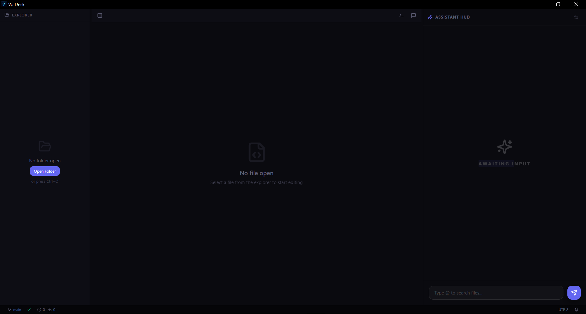

# VoiDesk 🌑

> A high-performance, AI-native IDE built for the future.

VoiDesk is a lightweight, blazingly fast code editor built with **Tauri 2.0** and **React**. It features a futuristic, dark-mode-first aesthetic and deeply integrated AI capabilities designed to enhance developer productivity without getting in the way.



## ✨ key Features

- **🚀 Native Performance**: Built on Rust (Tauri), ensuring extremely low memory usage and instant startup times compared to Electron-based editors.
- **🤖 Deep AI Integration**:
  - **Context-Aware Assistance**: Chat with an AI that knows your codebase. Use `@` to reference specific files.
  - **Streaming Responses**: Real-time AI generation with a rich, markdown-enabled chat interface.
  - **Agentic Capabilities**: The AI can read, write, create, and delete files directly (with your permission).
- **🖥️ High-Fidelity Terminal**:
  - Integrated `xterm.js` terminal with GPU acceleration.
  - Full PTY support via `portable-pty` for a native shell experience.
- **⚡ Modern Editor**:
  - Powered by **CodeMirror 6**.
  - Syntax highlighting for Rust, TypeScript, Python, and more.
  - Robust file tree with virtualization for handling large projects.
- **🎨 Void Theme**: A custom-designed deep space aesthetic with subtle animations and focus-driven contrast.

## 🛠️ Tech Stack

- **Frontend**: React 18, TypeScript, Tailwind CSS 4, Radix UI
- **Backend / Runtime**: Tauri 2.0 (Rust)
- **Editor Engine**: CodeMirror 6
- **Terminal Engine**: xterm.js + portable-pty
- **State Management**: Zustand
- **AI Orchestration**: adk-rust (Agent Development Kit)

## 🚀 Getting Started

### Prerequisites

- **Node.js**: v18 or newer
- **Rust**: Latest stable version (via rustup)
- **Visual Studio Build Tools** (Windows only) for C++ build dependencies.

### Installation

1.  **Clone the repository**
    ```bash
    git clone https://github.com/AlvinPlayz23/void-desk.git
    cd void-desk
    ```

2.  **Install dependencies**
    ```bash
    npm install
    ```

3.  **Run Development Server**
    Start both the frontend and the Rust backend in dev mode:
    ```bash
    npm run tauri dev
    ```

4.  **Build for Production**
    Create an optimized native executable:
    ```bash
    npm run tauri build
    ```

## 🆕 Recent Updates

- **Multi-Language Syntax Highlighting**: Full support for JavaScript, TypeScript, Python, Rust, HTML, CSS, JSON, and Markdown
- **File Watching**: The file tree now auto-refreshes when files are modified, created, or deleted outside the IDE
- **Find & Replace**: Press `Ctrl+F` to find in file, `Ctrl+H` for find & replace (supports regex and case-sensitive search)
- **Improved Drag & Drop**: Move files between folders or back to the workspace root with visual feedback

## 🗺️ Roadmap

- [x] Core Editor & File System
- [x] AI Chat & Context System
- [x] Integrated Terminal
- [x] File Watching & Auto-Refresh
- [x] Find & Replace
- [x] Multi-Language Syntax Highlighting
- [ ] LSP Integration (Language Server Protocol) - [See Plan](./LSP-PLAN.md)
- [ ] Git Integration
- [ ] Plugin System

## 🤝 Contributing

Contributions are welcome! Please feel free to submit a Pull Request.

## 📄 License

MIT © VoiDesk Team
